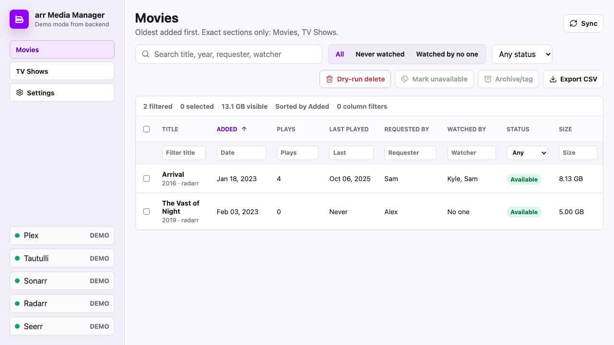
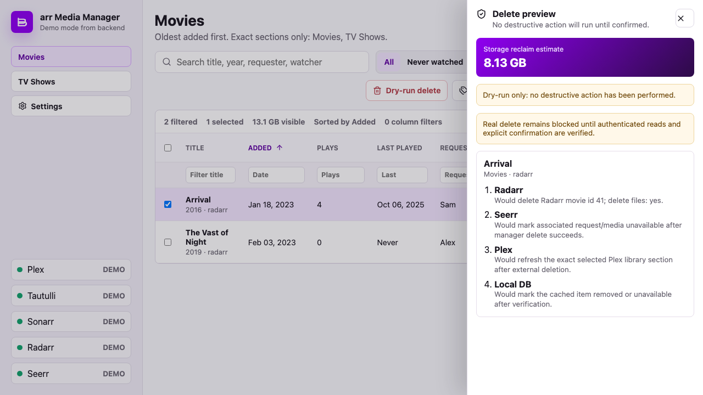

# arr Media Manager

arr Media Manager is a self-hosted media operations dashboard for auditing a Plex library and planning cleanup actions across Plex, Tautulli, Sonarr, Radarr, Jellyseerr/Overseerr, and optional legacy Overseerr request history.

Destructive actions are guarded: delete actions produce an authenticated dry-run preview first, and execution requires a typed confirmation. Radarr/Sonarr deletion is supported through their APIs; Seerr mutation remains disabled until the exact unavailable endpoint is verified against the configured service version.





## What It Does

- Syncs selected Plex libraries into a local SQLite cache.
- Enriches media rows with Tautulli and Plex play history, watched-by users, requesters, Radarr/Sonarr IDs, availability, and size.
- Merges requester history from current Jellyseerr/Overseerr and optional legacy Overseerr, matching by Plex rating key, Radarr/Sonarr ID, TMDB ID, TVDB ID, and IMDB ID where available.
- Sorts and filters by Title, Added, Plays, Last played, Requested by, Watched by, Status, and Size.
- Exports the current table view to CSV.
- Builds a dry-run delete preview that shows the exact Radarr/Sonarr, Seerr, Plex, and local DB steps before any destructive action.
- Stores service credentials in the runtime config file only; secrets are never returned to the browser.

## Deploy On Proxmox

Run this on the Proxmox host as `root`:

```bash
bash -c "$(curl -fsSL https://raw.githubusercontent.com/dubnz/Plex-Manager/master/scripts/proxmox-create-lxc.sh)"
```

The installer creates a native LXC service. Docker is not used.

Then enter the created container and configure credentials:

```bash
pct enter <CTID>
systemctl start plex-manager
systemctl status plex-manager --no-pager
```

Open:

```text
http://<lxc-ip>:8000
```

Use Settings to configure Plex, Tautulli, Sonarr, Radarr, and Seerr access. If you migrated to a new Jellyseerr/Seerr instance, configure Legacy Overseerr too so older requester history is still available.

See [DEPLOY.md](DEPLOY.md) for advanced and unattended install options.

## Runtime Files

- App checkout: `/opt/plex-manager`
- Service: `plex-manager.service`
- Environment file: `/etc/plex-manager.env`
- SQLite cache: `/var/lib/plex-manager/plex-manager.db`
- Runtime config: `/var/lib/plex-manager/config.json`

## Local Development

Backend:

```bash
python3 -m venv .venv
.venv/bin/python -m pip install -r requirements.txt
PLEX_MANAGER_DEMO_MODE=true DB_PATH=data/demo-runtime.db \
  .venv/bin/python -m uvicorn app.main:app --app-dir backend --host 127.0.0.1 --port 8000
```

Frontend:

```bash
npm --prefix frontend install
npm --prefix frontend run dev
```

Tests:

```bash
.venv/bin/python -m pytest backend/tests
npm --prefix frontend run test -- --run
npm --prefix frontend run build
```

## Public Repository Safety

Do not commit real `.env` files, runtime config JSON files, SQLite databases, API keys, Plex tokens, or Proxmox host secrets. This repository includes only placeholder values in `.env.example`.
